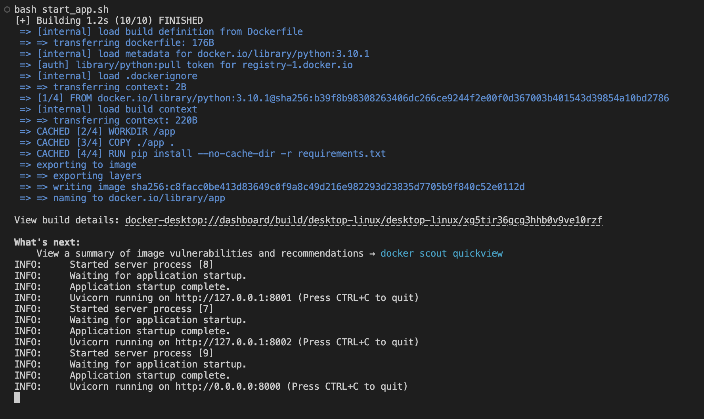
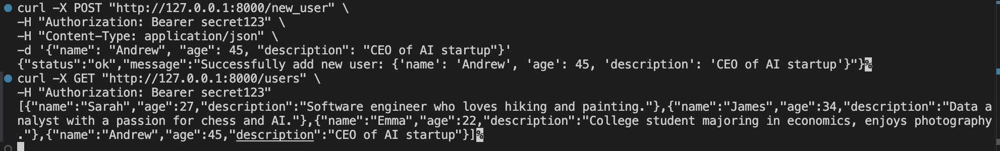
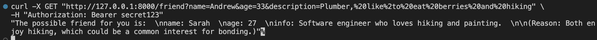

## HW2

**AUTH TOKEN**: secret123

**TOKEN FOR LLM**: create here https://openrouter.ai/

In this assignment, I have created a small microservice application that consists of three services: a client service (for external users), a business logic service, and a database service (both isolated from external use). The main idea of the application is to suggest a friend, based on the provided user information, among the list of users in the database.

### Request flow
- /user: user -> client service -> database service -> client service -> user
- /new_user: user -> client service -> database service -> client service -> user
- /friend: user -> client service -> business logic service -> db service -> business logic service -> client service -> user

### How to start the application
You need to have docker installed on your machine, then you can run start_app.sh inside project directory. The client service will be available on addresss ```http://127.0.0.1:8000```

### Usage
1. Start the application (inside project dir)
```
bash start_app.sh
```

2. Get all users
```
curl -X GET "http://127.0.0.1:8000/users" \
-H "Authorization: Bearer secret123"
```

3. Add new user
```
curl -X POST "http://127.0.0.1:8000/new_user" \
-H "Authorization: Bearer secret123" \
-H "Content-Type: application/json" \
-d '{"name": "Andrew", "age": 45, "description": "CEO of AI startup"}'
```

4. Get possible friendship suggestions
```
curl -X GET "http://127.0.0.1:8000/friend?name=Andrew&age=33&description=Plumber,%20like%2to%20eat%20berries%20and%20hiking" \
-H "Authorization: Bearer secret123"
```


### How token-based authentication works
Every time when user try to reach the client service, he/she needs to provide authentication token inside authorization header. Then, app will compare provided token with token inside runtime of app. In case, when they are the same, user will be able to use app. If they are different request will be rejected.
