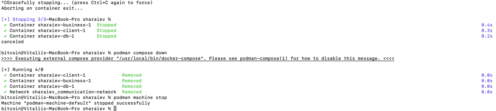

### Homework 3

## Task #1 - Wrap single application in container
1) Start application

2) Send request (any request from homework 2) - 

3) Check logs

4) Shutdown application and clean environemt

## Task #2 - Multi-container setup with a local network.
1) Start application

2) Send request (any request from homework 2) - 

3) Check logs

4) Shut down application and clean environment

